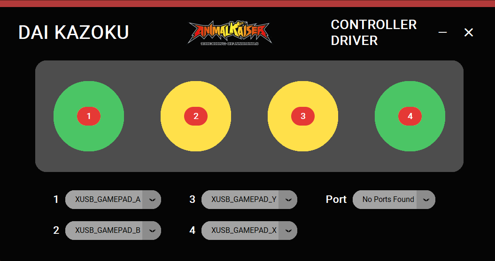

# Dai Kazoku Animal Kaiser Custom Controller
Animal Kaiser custom controller using ESP32-C3 Super mini + controller driver


 A high-performance, ultra-low latency custom arcade controller built specifically for Animal Kaiser emulators (and other arcade games). 

Since the **ESP32-C3 SuperMini** lacks native hardware support for USB HID (Keyboard/Gamepad), this project bridges the gap using **FreeRTOS-powered high-speed serial communication** (1000Hz polling rate) and a dedicated **Python Desktop Driver** that emulates an Xbox 360 controller via ViGEmBus.

## ✨ Features

* **Executable File:** The Python script is compiled into an executable file that can be run without Python installed.
* **Ultra-Low Latency:** Uses FreeRTOS tasks to poll arcade button states at 1000Hz (1ms response time) without blocking the CPU.
* **Zero-Ghosting:** Read multiple buttons simultaneously with independent debounce logic.
* **Virtual Gamepad Emulation:** Python script utilizes `vgamepad` (ViGEmBus) to make Windows recognize the device as a standard Xbox 360 Controller.
* **Modern GUI Visualizer:** Built with `customtkinter`, featuring a dark-mode interface, real-time button press visualizer, and customizable key mappings.
* **Hardware LED Feedback:** Arcade buttons light up instantly upon pressing directly controlled by the ESP32.

## 🛠️ Hardware Requirements

* 1x **ESP32-C3 SuperMini** (or any other ESP32 board).
* 4x **Arcade Push Buttons with LEDs** (3.3V or 5V compatible).
* Jumper Wires & Breadboard/Custom PCB.
* Micro-USB / Type-C Data Cable.

### Wiring & Pinout (ESP32-C3)

| Arcade Button | Microswitch Pin (INPUT_PULLUP) | LED Pin (OUTPUT) | Target Xbox Button |
| :--- | :--- | :--- | :--- |
| **Btn 1 (Green)** | GPIO 8 | GPIO 3 | A |
| **Btn 2 (Yellow)** | GPIO 10 | GPIO 5 | B |
| **Btn 3 (Yellow)** | GPIO 4 | GPIO 6 | X |
| **Btn 4 (Green)** | GPIO 2 | GPIO 7 | Y |

*Note: Wire one side of the microswitch to the GPIO and the other side to GND. Wire the LED positive terminal to the LED GPIO and the negative terminal to GND.*

## 💻 Software Requirements

### 1. Windows Kernel Driver (Crucial)
You **must** install the ViGEmBus driver for the virtual gamepad to work.
* Download and install the latest release from the [Nefarius ViGEmBus GitHub](https://github.com/nefarius/ViGEmBus/releases).

### 2. Microcontroller Firmware
* **Arduino IDE** with ESP32 Board Manager installed (v3.x recommended).
* **Important Setting:** In Arduino IDE, go to `Tools` -> `USB CDC On Boot` -> set to **`Enabled`**.

### 3. Python Environment
* Python 3.8 or newer.
* Install the required libraries:
    ```bash
    pip install customtkinter pyserial vgamepad Pillow
    ```

##  Installation & Setup

### Step 1: Flash the ESP32
1. Open the `.ino` file in Arduino IDE.
2. Select **ESP32C3 Dev Module** as the board.
3. Ensure `USB CDC On Boot` is **Enabled**.
4. Upload the code to your ESP32.

### Step 2: Run the Driver Application
1. Connect your ESP32-C3 to the PC via USB.
2. Open your terminal/command prompt.
3. Navigate to the project directory and run the Python app:
   ```bash
   python app.py